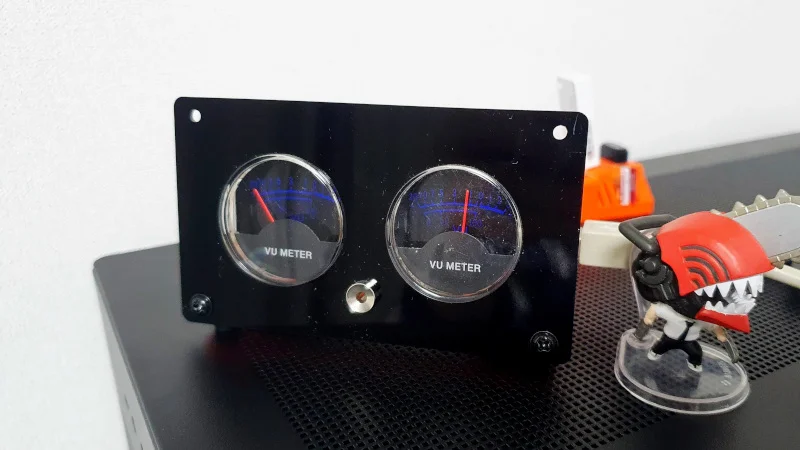

# Metric Gauge (Arduino)



Analog dual-gauge display driven by an Arduino over USB serial. A small Go daemon on the host reads CPU and memory usage (locally via gopsutil, or from a node-exporter `/metrics` URL) and sends PWM targets to the board.

For the ESP32-C3 + GC9A01 digital gauge firmware, see the [project README](../README.md).

## Hardware

| Part | Notes |
|------|--------|
| MCU | Arduino (or compatible board with `analogWrite`) |
| Gauges | 2× analog meter movements on PWM outputs |
| Host link | USB serial, **9600** baud |

### Pin map (`dual_gauge.ino`)

| Signal | Pin | Notes |
|--------|-----|--------|
| Gauge 1 (A1) | **11** | PWM output |
| Gauge 2 (A2) | **10** | PWM output |
| Status LED | `LED_BUILTIN` | Blinks while a serial command is processed |

Values are mapped from 0–100 (percent) to 0–255 (PWM). The sketch ramps the needle smoothly (~10 ms per step) instead of jumping instantly.

## Flash the Arduino sketch

1. Open [`dual_gauge.ino`](dual_gauge.ino) in the Arduino IDE.
2. Select your board and serial port.
3. Upload.

On boot the sketch prints:

```
Type command: A=[0-100],[0-100] or A[1|2]=[0-100]
```

## Serial protocol

Commands are newline-terminated (`\n` or `\r\n`).

| Command | Effect |
|---------|--------|
| `A=<left>,<right>` | Set both gauges (each 0–100) |
| `A1=<value>` | Set gauge 1 only |
| `A2=<value>` | Set gauge 2 only |

Examples:

```
A=42,67
A1=80
A2=15
```

## Host daemon (`server/`)

The Go program opens the serial port and periodically writes `A=<cpu>,<mem>`.

### Run locally

```bash
cd server
go run . -s /dev/ttyUSB0 -i 15s
```

| Flag | Default | Purpose |
|------|---------|---------|
| `-s` | `/dev/ttyUSB0` | Serial device path |
| `-i` | `15s` | Scrape / update interval |
| `-nodeexporter` | *(empty)* | node-exporter `/metrics` URL; when set, local gopsutil is disabled |

**Local mode** (no `-nodeexporter`): reads CPU and memory from the machine running the daemon via [gopsutil](https://github.com/shirou/gopsutil).

**node-exporter mode**: fetches Prometheus text from the given URL. CPU usage is computed from `node_cpu_seconds_total` deltas (first sample may report 0% CPU until a second scrape). Memory is derived from `node_memory_MemTotal_bytes` and `node_memory_MemAvailable_bytes`.

On shutdown (SIGINT / SIGTERM) the daemon sends `A=0,0` to zero both gauges.

### Build & run with Docker

Build from the `server/` directory:

```bash
cd server
docker build -t dev/metric_gauge:latest .
```

Run with the serial device attached:

```bash
docker run \
  -d --restart unless-stopped \
  --device /dev/ttyUSB0 \
  --name metric_gauge \
  dev/metric_gauge:latest
```

Pass extra flags after the image name, for example:

```bash
docker run \
  -d --restart unless-stopped \
  --device /dev/ttyUSB0 \
  --name metric_gauge \
  dev/metric_gauge:latest \
  -i 10s -nodeexporter http://host.docker.internal:9100/metrics
```

Adjust `/dev/ttyUSB0` to match your adapter (`/dev/ttyACM0`, etc.).

## License

This project is licensed under the MIT License — see [LICENSE](../LICENSE).
